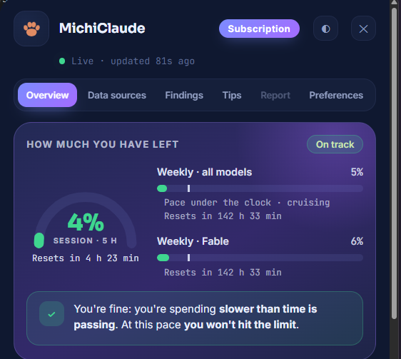
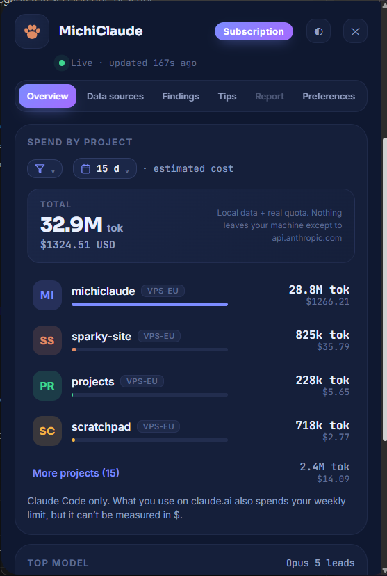
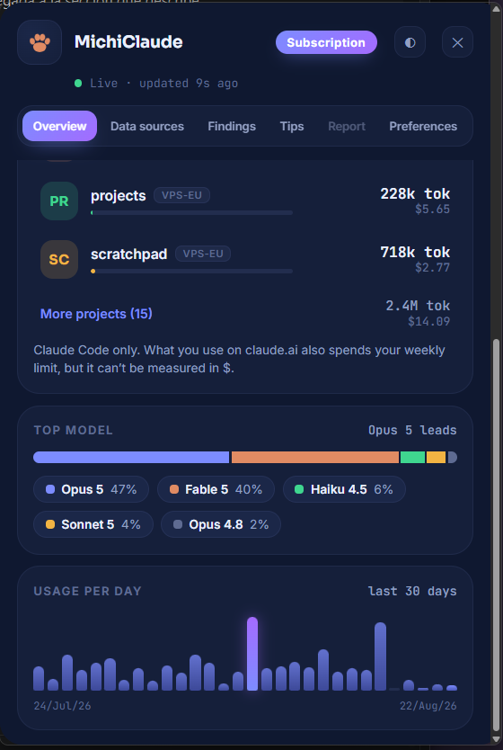
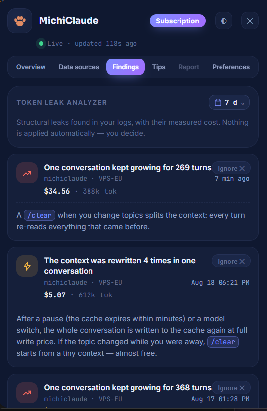
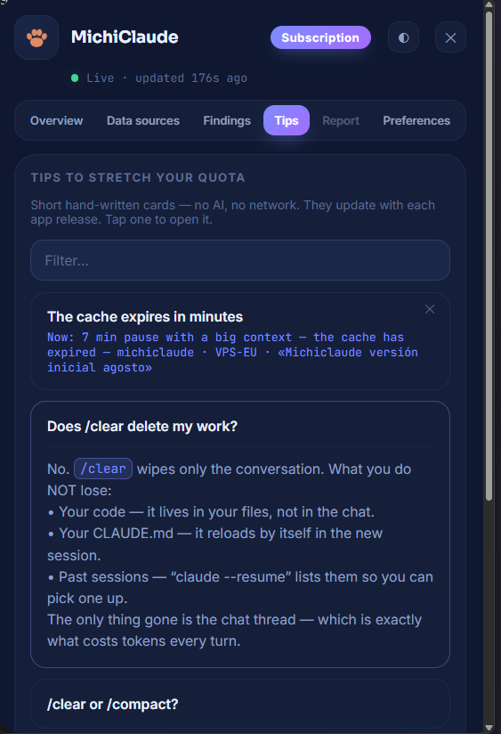

# MichiClaude 🐱

**🇬🇧 English** · [🇪🇸 Español](README.es.md)

<p align="center">
  <a href="https://github.com/oscarorozcos/michiclaude/releases/latest"></a>
  
  <a href="https://github.com/oscarorozcos/michiclaude/releases/latest"></a>
  <a href="LICENSE"></a>
  <a href="https://github.com/oscarorozcos/michiclaude/discussions"></a>
  <a href="https://www.linkedin.com/in/oscar-os/"></a>
</p>

<p align="center">
  
</p>

> 🚧 **Under active development** — the app is fully usable and gets daily
> use, but improvements keep landing (see [Roadmap](#roadmap)). Issues and
> suggestions are welcome.

A tray widget for **Windows 10 and 11** that shows, in real time, how much of
your Claude subscription you've used and how much is left:

- **Your plan's real quota** (the 5-hour session and the weekly limits, with
  per-model bars) — the same numbers you see at claude.ai → Settings → Usage,
  because those limits are shared across claude.ai, Claude Code and the IDEs.
- **Pace marker**: a line shows how much of the period has elapsed; if you're
  burning faster than the clock, the colors turn amber/red.
- **Projection**: "at this rate you hit 100% in X min, before the reset".
- **Estimated cost per project** (API-equivalent) broken down by model, over
  1/7/30-day periods, with a daily trend chart.
- **Leak analyzer**: finds where your tokens are being wasted — files read
  over and over, broken caches, MCP servers you installed and never used.
- **Coach**: watches your live session and tells you when a `/compact` or a
  `/clear` would pay off — and can type it for you if you let it.
- **Several machines on one dashboard**: your PC, WSL and servers over SSH.
- **Configurable alarms**, weekly budget, CSV/JSON export, light/dark theme
  and 8 languages.
- **Optional floating widget**: a minimalist pill… or a **programmer cat** 🐱
  that types away when you're fine, catches fire 🔥 when you cross your alarm
  and sleeps 😴 once your week runs out.

Built with [Tauri 2](https://tauri.app): a small native binary, an HTML/CSS/JS
frontend with no frameworks, and a minimal Rust backend.

> **What this first public version (0.2.0) opens up:** Overview, Data sources,
> Findings and Tips. The **Report** tab and everything that writes into your
> sessions — applying `/compact` and `/clear` for you, model routing, local AI
> analysis — exists in the code but ships **switched off**; it will open up in
> later versions, once validated in real use. Some sections below describe
> those pieces so you know what's coming. **This version only watches: it
> never touches your sessions.**

---

## Installing (end users)

1. Have [Claude Code](https://claude.com/claude-code) installed and signed in
   (run `claude` in a terminal and log in with your Pro/Max account). The app
   uses that same session — **no API key, no extra accounts**.
2. Download the installer (`.exe`) from [Releases](../../releases) and run it.
3. On launch you get a **tray icon** (next to the clock) with your session %
   drawn on it. Left click opens the panel; right click opens the menu.

> There are no mandatory setup steps: if you use Claude Code on that PC, your
> quota and per-project costs show up on their own.

### ⚠️ Windows will show you a warning the first time

When you run the installer, Windows may show the blue
**"Windows protected your PC"** screen, and for some users Defender even flags
the file. This is normal for any free program without a code-signing
certificate (certificates cost money every year; this project is free and open
source). It doesn't mean the program carries anything — it means Windows
doesn't know the publisher yet.

**To open it:** click **"More info"** → **"Run anyway"**.

#### Verify it yourself — don't take my word for it

- **Does it have a virus?** Here is the
  [VirusTotal analysis of v0.2.0](https://www.virustotal.com/gui/file/014c7870beaa44c3fbed5736283322064fdb0f5f802120a7d0a6a42641cf857e/detection):
  **68 out of 70 antivirus engines report it clean**, including all the major
  ones (Kaspersky, BitDefender, ESET, Avast, CrowdStrike…). The 2 that flag
  it are machine-learning heuristics reacting to "unsigned installer"; the
  false positive has already been reported to Microsoft. The behavior
  analysis in that same report shows **zero network connections** from the
  installer.
- **Are updates safe?** The app only accepts updates cryptographically signed
  with the project's key (every release publishes its `.sig` next to the
  installer). A binary altered by even one byte will not install.
- **Would you rather not trust binaries at all?** Clone the repository and
  build it yourself: [BUILD.md](BUILD.md).
- **What about network traffic?** Run it with Wireshark or a network monitor
  open: you'll only see `api.anthropic.com`. If you see anything else, report
  it as an issue — that's exactly the kind of report I want to receive.

### Which Windows version do I need?

**Windows 10 or Windows 11.** So far it has only been tested on Windows 11
(that's where it's developed), so Windows 10 *should* work unchanged but isn't
verified — if you try it there, tell us in an issue.

What sets that floor isn't the app, it's the pieces it runs on:

| piece | minimum | why |
| --- | --- | --- |
| Tauri 2 (the engine) | Windows 10 | version 2 dropped support for Windows 7 and 8 |
| WebView2 | Windows 10 | preinstalled on 11; on 10 it arrives with modern Edge, and if missing the installer downloads it |
| Notifications | Windows 10 | they use the modern toast API, which doesn't exist before |
| SSH client (optional) | Windows 10 | only if you connect a server; bundled since then |
| Widget windows | Windows XP | `SetWindowPos` and friends are ancient APIs: they limit nothing |

On **Windows 7 and 8 it does not work**, and that's not something MichiClaude
can fix from its side.

There's no macOS or Linux build: the dynamic tray icon and the floating widget
are written against Windows APIs.

### How much space and memory does it use?

**Measured** figures, not estimates (Windows 11, release build, panel open and
the cat on screen):

| | |
| --- | --- |
| Installer | **5.8 MB** |
| Installed on disk | ~22 MB |
| Your data (caches and settings) | **under 1 MB** |
| Memory in use | **~276 MB** |

**The installer is small because the app doesn't ship a browser inside.** The
interface is built with HTML, but it uses the WebView2 that Windows already
includes instead of packing its own. An equivalent Electron app runs 90-150 MB
to download.

Memory is the flip side of that same decision: every window the program opens
— the panel, the widget, its speech bubbles — is a web view and costs
something. To make those 276 MB mean anything, here they are measured with the
same yardstick at the same moment, on the development machine:

| | memory |
| --- | --- |
| Visual Studio Code | 799 MB |
| Browser (Brave) | 730 MB |
| Windows Explorer | 360 MB |
| **MichiClaude** | **276 MB** |

In other words: **a third of what your editor uses**. On an 8 GB machine you
won't notice it; on a 4 GB one with the browser open, you will.

We say this plainly because nobody else publishes the number: if what you want
is the absolute smallest footprint, a terminal tool will always win — you run
it, it prints a number, it's gone. MichiClaude stays on in exchange for
warning you *before* you run out of quota.

<details>
<summary>How to measure it yourself (PowerShell)</summary>

Careful with the method: adding up each process's "working set" **counts
shared memory several times over** and more than doubles the result. This adds
up **private** memory, which is the real one:

```powershell
$w=Get-CimInstance Win32_Process
$ids=@($w|? Name -eq 'michiclaude.exe'|% ProcessId)
do{$n=@($w|?{$ids -contains $_.ParentProcessId -and $ids -notcontains $_.ProcessId}|% ProcessId);$ids+=$n}while($n.Count)
$pf=Get-CimInstance Win32_PerfRawData_PerfProc_Process
"{0:N0} MB" -f ((($pf|?{$ids -contains $_.IDProcess}|measure WorkingSetPrivate -Sum).Sum)/1MB)
```

</details>

## First steps: what you're looking at

The panel has **six tabs**:

- **Overview** — the dashboard:
  - *How much is left*: the 5-hour session gauge plus weekly bars (one per
    model, depending on what your plan reports). The little vertical mark on
    each bar is the **pace**: if your usage bar passes it, you're going faster
    than the clock.
  - *At this rate*: burn-rate projection — if you keep this up, do you hit the
    limit before the reset?
  - *Spend per project*: estimated cost of each project (see the next section)
    over 1/7/30 days. Hover a project to see its per-model breakdown. Note:
    those dollars are **Claude Code only**. What you use on claude.ai also
    eats your weekly limit, but it can't be measured in dollars — the endpoint
    doesn't say what the cap is worth in money.
  - *Daily trend*: a chart of the last 30 days.
  - *Models*: which model you use most.
- **Data sources** — where the numbers come from, and adding SSH servers.
- **Findings** — the [leak analyzer](#findings-where-your-tokens-go-to-die).
- **Tips** — the [coach](#tips-the-coach).
- **Report** — [usage metrics](#report-is-this-getting-better) beyond the raw
  dollar figure.
- **Preferences** — language, floating widget, alarms, budget and export.

The footer (Today / period) is always visible on the Overview tab.

<p align="center">
  
</p>

<p align="center">
  
</p>

<p align="center">
  
</p>

## Where do you use Claude Code? (native Windows, WSL or a server)

An explanation without jargon, in case these terms are new. The underlying
idea is simple:

> Claude Code always leaves a "receipt" of what you spend, in a folder on the
> computer where you used it. **MichiClaude is a reader for those receipts.**
> The only thing that changes between the three cases is **which computer the
> receipts are on.**

Think of using Claude Code as **cooking**, and the receipts as the tickets for
what you spent:

### 🪟 Native Windows — you cook in your own normal kitchen

You install Claude Code **directly on Windows** (like any other program) and
use it in the Windows terminal (PowerShell). The receipts stay on your PC.

- *Example:* María opens PowerShell, types `claude` and asks it to "fix this
  error for me". Everything happened on her PC.
- *In MichiClaude:* **nothing to do, it's automatic.** It lives on the same
  Windows and finds the receipts by itself. Shows up as **"This PC"**.

### 🐧 WSL — a "mini Linux computer" INSIDE your Windows

WSL (Windows Subsystem for Linux) is a Windows feature that creates a sort of
**second computer running Linux, tucked inside your Windows**. Plenty of
people use it because Claude Code used to be Linux-only. It's like having a
separate kitchen in your house, in a different style, and cooking there: still
your house, but another little room.

- *Example:* Juan opens his "Ubuntu" (WSL looks like just another app), types
  `claude` in there and works. The receipts stay in that Linux room.
- *In MichiClaude:* **also automatic.** It looks into that Linux inside your
  Windows and reads them. They appear with their distro's suffix (e.g.
  *my-project · wsl-Ubuntu*), so if you have several you can tell them apart.

> 💡 **Native vs WSL in one line:** *native* = Claude Code runs on plain
> Windows; *WSL* = it runs on a Linux that lives inside your Windows. For you,
> both are on the **same physical PC**, and MichiClaude reads them **on its
> own**.

### 🌐 SSH — you cook in SOMEONE ELSE'S house (a server), remotely

SSH is a way to **connect to another computer somewhere else** (a server on
the internet, a "VPS") and use it as if you were sitting at it. You type on
your PC, but everything happens **on that other machine**, and the receipts
stay **over there**.

- *Example:* Lucía connects from her Windows to her server and runs `claude`
  there. Her PC is just the remote control; the work and the receipts live on
  the server. (In VS Code you can spot it because the bottom left says
  `SSH: <something>`.)
- *In MichiClaude:* here there **is one manual step, just once.** Since the
  receipts are on another machine, you tell MichiClaude to check that one too:
  **Data sources → add server** (a name plus the SSH address, the same one you
  already connect with). After that they show up under **the short name you
  chose** — for example `· work-server`.

### Summary

| Case | Where does Claude Code run? | What do you do in MichiClaude? |
|---|---|---|
| 🪟 Native Windows | On your PC, directly | Nothing — automatic ("This PC") |
| 🐧 WSL | On a Linux inside your PC | Nothing — automatic ("· wsl-Ubuntu") |
| 🌐 SSH | On another computer (a server) | Add it once under Data sources (it appears under the name you give it) |

**How do I know which one I have?** Look at what you open to use Claude Code:

- You open **PowerShell** (the blue Windows one) and type `claude` → **native**.
- You open an app that says **"Ubuntu"** or a Linux window → **WSL**.
- You **connect to a server** first (or VS Code shows `SSH: …` in the bottom
  left) → **SSH**.

In 2 of the 3 cases you do nothing: install MichiClaude and you're done. Only
the server needs a small setup step.

### What if I use VS Code, Cursor or another editor? (not a terminal)

**The editor doesn't matter — it works the same.** Whatever you use (VS Code,
Cursor, JetBrains or a bare terminal), under the hood they all run the **same
Claude Code**, which leaves its "receipts" in the same folder. MichiClaude
doesn't care *what* you use it with, only *which machine* it runs on. So:

- **VS Code / Cursor locally on your PC** (not connected to anything) →
  automatic, shows up as **"This PC"**, same as the terminal.
- **VS Code working inside WSL** (bottom left says `WSL: …`) → automatic,
  shows up as **"· wsl-Ubuntu"**.
- **VS Code Remote-SSH** (bottom left says `SSH: …`) → that's the server case:
  add it once under Data sources.

> 🔑 **Rule of thumb:** it's not about **what** you use Claude Code with, it's
> about **where it runs**. Same PC → local, automatic; WSL → "· wsl-Ubuntu",
> automatic; server over SSH → add it once.

## Where do the dollars come from? (estimated cost)

From two ingredients, **both on your machine**:

1. **Your local Claude Code logs** (`~/.claude/projects/**/*.jsonl`): every
   request is recorded with its tokens (input, output, cache) and the model
   used. The app parses them with deduplication (logs repeat entries when you
   resume sessions) and leaves cache reads out of the "working" token count
   (it only counts them toward cost, at their real price).
2. **Anthropic's public API prices**, which the app **downloads and keeps up
   to date by itself** (see *The price download* below). With no network it
   uses the last cache and, as a last resort, this built-in table (USD per
   million tokens):

   | Model | Input | Output | Cache write | Cache read |
   |---|---|---|---|---|
   | Fable 5 | $10 | $50 | $12.50 | $1.00 |
   | Opus 4.5 and later | $5 | $25 | $6.25 | $0.50 |
   | Opus 3 / 4.0 / 4.1 | $15 | $75 | $18.75 | $1.50 |
   | Sonnet (and unrecognized) | $3 | $15 | $3.75 | $0.30 |
   | Haiku | $1 | $5 | $1.25 | $0.10 |

**Example**: a project that used 2M input tokens and 0.5M output with Sonnet →
2×$3 + 0.5×$15 = **$13.50 API-equivalent**.

> 💡 **Important**: for subscribers this cost is **notional** ("API equiv.") —
> it isn't money you paid, it's what it *would have cost* on the API. It's
> useful for seeing which project eats the most and how much your subscription
> saves you. It's only real spend if you use an API key.

> ⚠️ **With subagents the cost can fall short.** When Claude Code delegates
> work to subagents, part of that usage isn't always reflected in the local
> records the app can read, so the cost shown may be **lower than the real
> one**. That's a limitation of the records themselves, shared with similar
> tools (`ccusage` included), not a calculation bug. **Your quota is
> unaffected**: the session and weekly gauges come from your account and are
> always exact.

### What counts as a "project"?

A project is **not** each terminal you open: it's **the folder you run
`claude` from** (the working directory). That's how Claude Code groups its
records, and the app inherits that grouping:

- 5 terminals open in the same folder, all day → **a single project** that
  accumulates all that spend.
- You run `claude` in another folder → **another project** appears in the list.
- You run `claude` sitting in your user folder "just for a quick question" →
  that creates its own project too (with odd names like `oscar` or
  `Downloads`). Strange-looking projects in the list come from there.

> ✅ **Tip**: always run `claude` **inside the folder of the project** you're
> working on — that keeps the cost breakdown clean and meaningful.

**Where do the names come from?** From the real working path recorded in the
logs: the app takes the last segment (`/opt/projects/my-site` → `my-site`).
When the spend comes from another machine, the origin is appended: `my-site ·
wsl`, `my-site · work-server` (the suffix is the short name you gave the
server, so you pick it).

## Findings: where your tokens go to die

The **Findings** tab is a leak analyzer. It reads the same local logs and
looks for patterns that burn tokens without giving anything back. Each finding
is a card with what happened, roughly what it cost you, and what to do about
it. Severity is by cost: red from $10, amber from $1.

<p align="center">
  
</p>

What it looks for, in plain terms:

| Finding | What it means |
|---|---|
| **Repeated reads** | The same file *and the same line range* read 3+ times in one session. Attaching it once is cheaper. |
| **Context inflation** | A session whose context grows past +50k over 10+ turns without a compaction. |
| **Broken cache** | 300k+ tokens rewritten because the start of the conversation changed and the cache had to be rebuilt. |
| **Mechanical commands** | 5+ `git` / `pytest` / `cargo` / `npm` runs handed to the model. Those you can run yourself for free. |
| **Heavy subagents** | 50k+ tokens spent in delegated sessions. |
| **Repeated auto-compactions** | The same project hitting Claude Code's automatic compaction 3+ times — a sign of sessions running too long. |
| **Giant pastes** | 3+ messages of 5k+ characters. Usually a file that should have been attached. |
| **Noisy hooks** | Hooks firing 15+ times and injecting 10k+ tokens. |
| **Unused MCP servers** | Configured, loaded into every session, never called. |
| **Unused skills** | Same idea. |
| **Ignored CLAUDE.md** | Its content is loaded every session but nothing in it is ever referenced. |
| **Oversized CLAUDE.md** | Past 40k characters Claude Code stops loading the rest — the tail simply isn't read. |

Every card can be **ignored** (it won't come back) and marked as read by
clicking it. The count on the tab and the red sticky note on the cat only
clear as you actually read them, one by one.

**These never go to your phone.** Findings mention project names, so they stay
on the machine (see [Privacy](#privacy-and-what-it-connects-to)).

## Tips: the coach

<p align="center">
  
</p>

The **Tips** tab has two halves.

**Curated advice** — eight fixed cards on how to spend less: when to compact,
how to keep the cache warm, why attaching beats re-reading, and so on.

**Live session coaching** — MichiClaude watches your open sessions and raises
a card when something specific happens:

- Context past 60% of the model's window → a `/compact` would pay off.
- You've been paused 6+ minutes with a warm context → the cache is going cold.
- The same file read 3 times → attach it instead.
- 10+ images in one session.
- **Session receipts**: when a session goes quiet for 10 minutes, you get a
  summary with how long it lasted, how many commands and files it touched,
  roughly what it cost, and any waste it noticed on the way.

There's a daily cap of 10 cards so it never turns into noise, and, like
Findings, a card is "read" only when you click it.

### The context gauge and the automatic commands

The widget shows a **context pressure gauge** — an arc on the pill, a light
bulb over the cat — with how full your session's context window is. It divides
by the *real ceiling of the model in that session*, not a fixed number.

Past 80%, the coach offers you the choice it thinks fits, with the command
next to it: `/compact` if your next message builds on this session, `/clear`
if you're starting something new. You can copy the command, or let MichiClaude
type it for you:

- **Automatic `/compact`** (off by default) — a 15-second countdown that says
  out loud which command it's about to send, with the widget in plain view.
  Any keystroke cancels it. Once per session.
- **Automatic `/clear`** (off by default) — the same, but it *only* runs after
  a `/export` copy of your conversation has been verified on disk. If the copy
  doesn't appear, nothing is deleted.

Both need the session to be opened through the relay (`michi claude` instead
of `claude`, or a setting that makes `claude` go through it). The relay only
ever sends **two** commands, `/compact` and `/clear`, and that whitelist is
enforced on both sides.

### Local analysis with AI (optional, off by default)

To choose between `/compact` and `/clear`, the coach has to guess whether
you're continuing the same topic or starting a new one. Most of the time the
plain signals are enough (open to-dos, whether you keep touching the same
files, whether you just committed). When they aren't, you can let a **local
model** decide.

- It runs **on your machine**, on `127.0.0.1`, started only when needed and
  killed as soon as it answers. **Nothing about your conversation leaves the
  computer.**
- Turning it on downloads the models once: a fast embeddings model (~319 MB)
  and, optionally, a 2B model for the ambiguous middle ground (~1.7 GB total).
  This download is the **only** connection MichiClaude makes outside
  `api.anthropic.com` that involves your content in any way — and even then,
  it's a download, not an upload.
- If the models aren't there, everything degrades quietly back to the
  non-AI behavior.

## Report: is this getting better?

The **Report** tab answers a question the raw dollar figure can't: are you
spending *well*?

- **Useful turns**: how many of the messages in a period were actually you
  talking to Claude, as opposed to tool results, injections and compaction
  summaries. Cost per useful turn is a far more honest number than cost alone.
- **Structural waste %**: how much of your spend went to the patterns the
  analyzer knows about.
- **Quota history**: up to 90 days of readings, so you can see whether your
  weeks are getting tighter.
- **"1M tokens ≈ $X"** computed with the *real* rate for that period, never a
  fixed one.

If there isn't enough data yet, it says so instead of drawing something. The
app never prints a number it can't actually compute.

## Preferences

| Option | What it does |
|---|---|
| **Language** | 8 languages; autodetected the first time. |
| **Floating widget** | Shows the pill (or the cat) always visible above the taskbar. Also toggleable from the tray icon's menu. |
| **Widget style** | *Pill* (brand + % + S/W bars) or *Cat with laptop* 🐱. |
| **Session alarms** | The % marks you want warning at (80 and 95 by default). When you cross one, the notice repeats every 5 min **until you open the panel** (acknowledgement). |
| **Weekly budget in $** | If the 7-day estimated cost goes over it, you get a warning (once a week). 0 = no warning. |
| **Phone alerts** | Sends quota warnings to your phone via [ntfy](https://ntfy.sh). Off by default; see below. |
| **Automatic `/compact` and `/clear`** | Off by default. See [the automatic commands](#the-context-gauge-and-the-automatic-commands). |
| **Local analysis (AI)** | Off by default. See [above](#local-analysis-with-ai-optional-off-by-default). |
| **Export data** | Saves CSV or JSON of the breakdown to the folder you choose (empty = Downloads). |

### Phone alerts 📱 (optional)

It's for the same thing a kitchen timer is: you walk away and it calls you.
Especially useful if you leave Claude working on its own and get up, or if you
ran out of quota and **shut the machine down**.

**How to turn it on** (about 30 seconds):

1. Install the free **ntfy** app on your phone (Android / iPhone).
2. In MichiClaude: *Preferences → Phone alerts* → tick the box.
3. Scan the QR with your phone's **normal camera** (the ntfy app has no
   scanner of its own) and let it open in ntfy. On iPhone, or if the QR won't
   open the app, hit **Copy** and add that channel to ntfy by hand.
4. Press **Send test**. If the phone buzzes, you're done.

**What you get:**

| When | Message |
|---|---|
| Your session or your week runs out | "Out of session quota. Back in 45 min. **You can shut the computer down: I'll tell you when it's back** 🐱" |
| At reset time | "Session quota restored" — **this one arrives even with your computer off** |
| When you cross a % alarm | Only if you tick "Also send my % alarms". |
| A long session finishes, or Claude is stuck waiting for your approval | Only if you tick "Tell me when a long session finishes". You get how long it ran, how many turns it took, and a *count* of the waste it spotted — never the dollars, the files or which rule fired. |

By default those messages don't say **which** project they're about. There's a
separate box, *"Include the project name (the channel is public)"*, that adds
it — the warning in its own label is the point: think before ticking it.

The reset-with-the-machine-off part isn't magic: on hitting the limit, the app
leaves the second message **scheduled on the ntfy server** with the exact
delivery time, and that server pushes it to your phone when the moment comes.
(There's a 3-day cap; if your weekly reset is further out, nothing is
promised — the first message just tells you the day.)

#### ⏱️ Arriving late? Turn on instant delivery

If the alert arrives minutes later (or much later), **it's not MichiClaude and
it's not the server: it's Firebase**, Google's notification system that the
Play Store build uses for `ntfy.sh` channels. Their own docs warn about it:
without instant delivery, messages "may be delayed significantly — sometimes
many minutes, or even hours".

One switch on the phone fixes it:

1. Open **ntfy** → **⋮** menu → **Settings** → turn on **Instant delivery**.
2. A permanent ntfy notification appears ("Subscription service"). **That's
   normal and it's the thing doing the work**: it holds a connection open
   instead of relying on Firebase.
3. Also, on Android: **Settings → Apps → ntfy → Battery → Unrestricted**. Left
   on "Optimized", the system will put it to sleep anyway.

With that, alerts land in seconds, even with the screen off. The cost is some
battery (an idle connection, not much).

Two shortcuts that also avoid it: install ntfy from **F-Droid** (that build
has no Firebase and is always instant), or **run your own ntfy server**, since
the app only goes through Firebase for `ntfy.sh` channels.

This **doesn't affect** the scheduled "your quota is back" message: the server
delivers that one on time and it works fine with the computer off.

#### If you run MichiClaude on two or three computers

Each install **creates its own channel**, and that's on purpose:

- On your second PC you repeat the same steps: tick the box and scan **the new
  QR** with the same phone. Your ntfy app ends up with two channels.
- Shared settings (*Data sources → Save to server*) **don't copy this
  channel**: that screen promises not to store passwords, and the channel
  **is** the password. You enable it by hand on each machine — 30 seconds.
- **Upside**: in the ntfy app you can mute one channel without touching the
  other — let the home PC always ping you and the work one stay quiet on
  weekends.
- **Watch out**: quota belongs to your *account*, not the machine. If two PCs
  are on when it runs out, **each one alerts you on its own channel** (two
  notifications for the same event). That's expected; mute one channel.

#### Treat the QR like a password

ntfy has no accounts: **the channel is the secret**. Anyone who knows it
receives your alerts (and can send you fake ones). That's why the channel is
generated randomly on your machine, and why **you shouldn't post screenshots
showing your QR or your channel**. If one leaks, the **New channel** button
generates another and kills the old one (you'll have to re-scan on your phone).

As a safeguard, only **percentages and reset times** travel over that channel:
never project names, never paths, never what you spend. The worst an intruder
would see is "somebody is at 80% of their session".

#### What does it cost? Is there a limit?

It's **free and account-free**. The public server doesn't impose a daily
message quota: it rate-limits *requests* (about 60 in a row, then one every 5
seconds). MichiClaude sends a handful of messages a day at worst — a couple
per limit reached and, if you enable them, your % alarms. You won't come
close. If you'd rather not depend on the public server, ntfy is open source
and you can run your own: put its address in `"server"` inside
`%APPDATA%\com.oscarorozco.michiclaude\ntfy_config.json`.

### The cat widget 🐱

<p align="center">
  
</p>

- **"Session X%" capsule** over its head, always visible.
- **A light bulb** above it showing context pressure for your live session;
  hover it for the details.
- **Hover the cat** → a comic bubble with session, weekly and whatever
  per-model buckets your plan reports; it folds away when you leave.
- **Sticky notes on the laptop lid**: a red pile for unread findings and a
  teal one for coach tips. Clicking one opens the panel straight to that tab.
- **Click the sticker** on its screen → opens the panel.
- **Drag it** wherever you want (multi-monitor works); right click hides it.
- States: normal → 🔥 when you cross an alarm (in cat mode the % alarms arrive
  as a **comic bubble with an ✕** instead of a Windows notification) → 😴 once
  the week hits 100%, until the reset.

### Data sources (optional, for watching several machines)

- **This PC**: automatic (Claude Code logs).
- **claude.ai**: automatic, via your account's quota.
- **WSL**: automatic — its projects show up as "name · wsl-<distro>" (e.g.
  "· wsl-Ubuntu"), so two distributions can be told apart.
- **Servers** (VPS, etc.): a name plus an SSH host under *Data sources* and
  that's it — **you don't have to copy or install anything**. Their projects
  appear as "name · server"; if a server doesn't answer it's skipped silently
  and your local data never blocks. Step by step with an example below.
- **HUB mode**: if you run MichiClaude on several machines, one server can
  consolidate everyone's snapshot so the totals add up on any PC.

#### Connecting a server, step by step

**The problem.** If you use Claude on your own computer, MichiClaude detects
it and counts it right away. But if you connect to a remote computer (a cloud
server) to work from there, MichiClaude can't guess what you're spending on
that other machine.

**The fix.** Give it permission to connect to your server, check how much
you've used there, and add that spend to your total.

##### The 3 requirements

1. **Being able to connect without typing a password.** MichiClaude works on
   its own in the background, so it can't sit waiting for you to type
   anything: it needs an *SSH key* (an automatic-access file).
2. **Having Python on the server.** Almost every Linux ships it. You don't
   need to check: MichiClaude looks for it and, if it can't find it, tells you
   with instructions.
3. **Having used Claude Code at least once on that server.** If you've never
   run `claude` there, there's no spending history to read.

> On **Windows** you also need the SSH client, bundled since Windows 10. To
> check, type `ssh` in PowerShell: if it answers with the help text, you have
> it. If not: Settings → Apps → Optional features → *OpenSSH Client*.

##### A real example, step by step

Meet **Carlos**. He codes from his laptop, but has a cloud server
(`carlos@203.0.113.10`) where he runs his heavier projects.

**Step 1 — Check password-less access.** In his laptop's terminal:

```bash
ssh carlos@203.0.113.10
```

- *It lets him straight in:* done, on to step 2.
- *It asks for a password:* he fixes it by running **once** on his laptop
  `ssh-copy-id carlos@203.0.113.10`, which copies his key to the server so it
  stops asking.

**Step 2 — Use Claude on the server.** Once connected, he enters a project and:

```bash
claude "explain this code to me"
```

That creates the first spending record **inside** the server.

**Step 3 — He adds it in MichiClaude.** He opens the panel from the tray icon
(next to the clock) and goes to **Data sources → Add server**:

- **Short name**: `work-server` (whatever he likes, it's just for recognizing it)
- **SSH host**: `carlos@203.0.113.10` (exactly what he types after `ssh`)
- Press **Test and add**

**What happens next?** MichiClaude connects, drops its own 16 KB reader in
`~/.michiclaude/` on that server and starts reading **only the usage numbers**.
From then on Carlos sees his local spend added to the server's, tagged
`· work-server`.

##### Quick questions

**Is it safe? Will it read my conversations or my code?**
No. The reader it installs only adds up token counters. It doesn't read your
messages, your files or your code, and none of that leaves the server.

**What about the "Command to run" field under Advanced options?**
Leave it blank. MichiClaude already finds Python on its own and uses its own
reader, in a folder it controls — **it assumes nothing about your server's
paths**. You'd only fill it in if you wanted to run your own build of the
reader; in that case nothing is written to your server.

**What if I get an error?**

| Message | What to do |
|---|---|
| `Permission denied` | The password-less key is missing: `ssh-copy-id user@server` |
| `No Python 3.7 found…` | On the server: `sudo apt install python3` |
| `Couldn't run ssh` | Install the *OpenSSH Client* on Windows (see above) |
| Added but no data shows | Run `claude` at least once on that server |

## Privacy and what it connects to

The short version: **your token, your conversations and your code never leave
your machine.** The longer version is the table, because the app does talk to
a few public addresses and you deserve to know which.

| When | Where | What travels |
|---|---|---|
| Always | `api.anthropic.com` | Your Claude Code OAuth token, to read your own quota — the same domain Claude Code already talks to. |
| Once a day (can be turned off) | LiteLLM (via `raw.githubusercontent.com`), `models.dev`, `openrouter.ai` | Nothing. An anonymous GET of a public price table. |
| At startup and every 12 h | `github.com` (this project's Releases) | Nothing but the request. It checks whether a newer version exists; the signed installer is only downloaded if you accept. |
| Only with phone alerts on | `ntfy.sh` (or your own server) | Percentages, reset times, and — if you enable that alert — how long a session lasted and how many turns it took. Never paths, never figures, and never the project name unless you explicitly tick the box for it. |
| Only when you enable local AI analysis | `huggingface.co` and `github.com` | Nothing. A one-time model download (~319 MB or ~1.7 GB). |
| While local analysis runs | `127.0.0.1` | Your conversation — to a model running on **your own computer**, which is shut down again as soon as it answers. |

Everything below the first row is optional or can be disabled. What is never
sent, under any configuration: your token (except to Anthropic), your paths,
your file contents, your spending figures, or any usage telemetry. **The app
collects no statistics about anyone.** Project names are the single exception,
and only if you deliberately turn on a checkbox that says so — see below.

Where the numbers come from:

1. The app reads the OAuth token from `~/.claude/.credentials.json` (created
   by Claude Code when you log in).
2. With that token it queries `https://api.anthropic.com/api/oauth/usage` —
   the same service claude.ai's Usage page uses.
3. Per-project costs come from parsing your local `.jsonl` files; none of that
   leaves your machine.

### Phone alerts, in plain terms

This is the one feature that **sends** something, which is why it's optional
and ships off.

- What goes out: the same text you'd see on screen — "Out of session quota.
  Back in 45 min", "Session at 80%" — plus the reset time. **Never** the
  token, project names, paths or spending figures.
- Where to: the configured ntfy server (`ntfy.sh` by default). That server
  sees your IP, like any HTTP request, and **ntfy channels are public by
  design**: the random channel name is what acts as the password. That's
  exactly why what gets sent is deliberately limited.
- How to turn it off: the same tick box in *Preferences*. And if you want your
  own ntfy server (it's open source), change `"server"` in
  `%APPDATA%\com.oscarorozco.michiclaude\ntfy_config.json`.

**Findings are never sent to your phone**, precisely because they're built
around project names.

Coach cards aren't sent either, with one deliberate exception: the two "you
can walk away" alerts — *a long session finished* and *Claude is waiting for
your approval* — which is the whole point of having alerts on your phone.
They're behind their own checkbox, they carry only durations and counts, and
the project name is only included if you tick the second box.

### The price download, in plain terms

Anthropic doesn't publish its rates in any API, so MichiClaude takes them from
the public tables the community maintains, cascading by reliability:
[LiteLLM](https://github.com/BerriAI/litellm) (the one `ccusage` uses) →
[models.dev](https://models.dev) → [OpenRouter](https://openrouter.ai). The
result is cached and only retried every 24 h; with no network it falls back to
the cache and, ultimately, to a table built into the app.

What that means exactly:

- It's an **anonymous GET of a public JSON file**. Your token isn't sent, nor
  your projects, nor identifiers, nor statistics: it only downloads.
- Like any HTTP request, that server sees your IP address.
- **It can be turned off.** There's deliberately no switch in the interface
  (turning it off only leaves you with stale prices, and it was too easy to do
  by accident), but there is one in the config: set `"auto": false` in
  `%APPDATA%\com.oscarorozco.michiclaude\prices_config.json`. In that same file
  you can change the source URLs (`litellm_url`, `modelsdev_url`,
  `openrouter_url`) if you'd rather use your own mirror.
- Inside the app, **Preferences → Model prices → ⓘ** shows these same sources,
  so nobody has to read the README to find out.
- If a model isn't in any table, it's flagged with `~` in the app instead of
  being silently charged at an assumed rate.

> ⚠️ **The usage endpoint is not an official API**: Anthropic doesn't document
> it for third parties and could change or switch it off without notice. If
> that happens, the quota gauges would stop working until the app is adapted
> (the rest — local costs — would keep working). The app parses the response
> dynamically precisely to tolerate changes.
>
> 🔒 **Your token never leaves your machine except toward
> `api.anthropic.com`** (the same official domain Claude Code already
> connects to). It's never sent to third-party servers, never logged and never
> shown on screen. Being open source, you can verify all of this in the code.

## Updates

MichiClaude updates itself. It checks at startup and every 12 hours; when
there's a new version you get a banner in the panel header. The installer is
downloaded from this project's Releases and its **signature is verified**
before installing — if the signature doesn't match, nothing is installed.

If the automatic install fails for any reason, the app offers a button to
download it by hand from Releases. That address is a constant compiled into
the app: it never comes from a downloaded file.

## Plan compatibility

| Plan | Quota (gauges) | Cost per project |
|---|---|---|
| Pro / Max 5x / Max 20x | ✅ dynamic buckets (Sonnet/Opus/Fable/whatever exists) | ✅ (notional) |
| Team/Enterprise with Claude Code | ✅ | ✅ |
| API key only | ✗ (no subscriber windows) | ✅ (real spend) |
| claude.ai web only, no Claude Code | ✗ | ✗ |

### Does it work with Claude's free plan?

**No.** MichiClaude measures **Claude Code** usage, and Claude Code requires a
Pro/Max subscription (or a paid API key) — it isn't available on claude.ai's
free plan. Without Claude Code there's neither a quota token nor local logs:
**there's nothing to measure** (the app would show "sign in to Claude Code"
and $0.00).

The subscription-free alternative: use Claude Code with an **API key** from
[console.anthropic.com](https://console.anthropic.com) (pay as you go). In
that case you'd see per-project costs — and they'd be **real dollars**, not
estimates — though not the quota gauges, which are a subscriber thing.

---

## Development

Requirements (Windows 10 or 11): [Rust](https://rustup.rs) stable, Node.js
18+, VS Build Tools (C++), WebView2 (preinstalled on Windows 11; on 10 it
arrives with modern Edge) and Claude Code signed in.

```powershell
npm install
npm run icons     # generates src-tauri/icons/ from app-icon.png (first time only)
npm run dev       # development
npm run build     # NSIS installer in src-tauri/target/release/bundle/nsis/
```

**Automatic releases**: pushing a `v*` tag makes GitHub Actions build the
installer and publish it to Releases.

```bash
git tag v0.1.0 && git push origin v0.1.0
```

## Roadmap

Done since the first public release: HUB mode, self-updating from Releases,
incremental log scanning, configurable prices, the leak analyzer, the coach
with its automatic commands, and the Report tab.

What's being looked at next:

- [ ] Date ranges (not just "the last N days") across all machines
- [ ] Themes over the leak analyzer: splitting a long session into topics to
      show what an earlier `/clear` would have saved
- [ ] A shareable weekly card from the cat

Not planned: tracking tools other than Claude Code, a history database, or a
team/multi-user mode.

## Contributing

Contributions are welcome, but **please open an issue before writing code**:
this is a single-author project with fairly strict design rules (vanilla
frontend with no dependencies, zero telemetry, never render a figure that
can't be computed) and it would be a shame for you to work on something that
doesn't fit.

Read **[CONTRIBUTING.md](CONTRIBUTING.md)** before your first PR. It contains
the contribution agreement: by opening a Pull Request you keep your authorship
and your contribution goes in under GPL-3.0, but you grant permission to
relicense it — so the project can also be offered under a commercial license
in the future without having to track down everyone who ever contributed a
line. You're also asked to declare the origin of any third-party material you
include (images and sounds especially, for the reason explained below).

Reporting a bug or suggesting an idea in an issue requires none of this.

## License

**Code: [GPL-3.0](LICENSE)** — use it, modify it and share it freely; if you
distribute a modified version it must stay open source under this same license
and keep the credits. © 2026 Oscar Orozco.

**Exception**: the mascot gifs and the sticker (`src/cat*.gif`,
`src/sticker*.png`) are **fan-art derived from the Bongo Cat meme** (original
cat artwork by [@StrayRogue](https://twitter.com/StrayRogue), meme animation
by [@DitzyFlama](https://twitter.com/DitzyFlama)). They are **not** covered by
the GPL; they're included only as part of the app and the rights to the
character belong to their authors. See the detail at the end of
[LICENSE](LICENSE).
